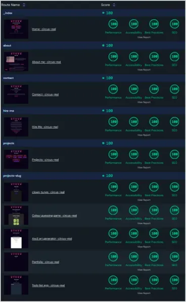

# My Portfolio

[Unlighthouse](https://unlighthouse.dev/) report of my portfolio:

If you're struggling to read the text - it is quite blurry - _every page has straight 100s for everything_! That's the power of [Astro](https://astro.build).

